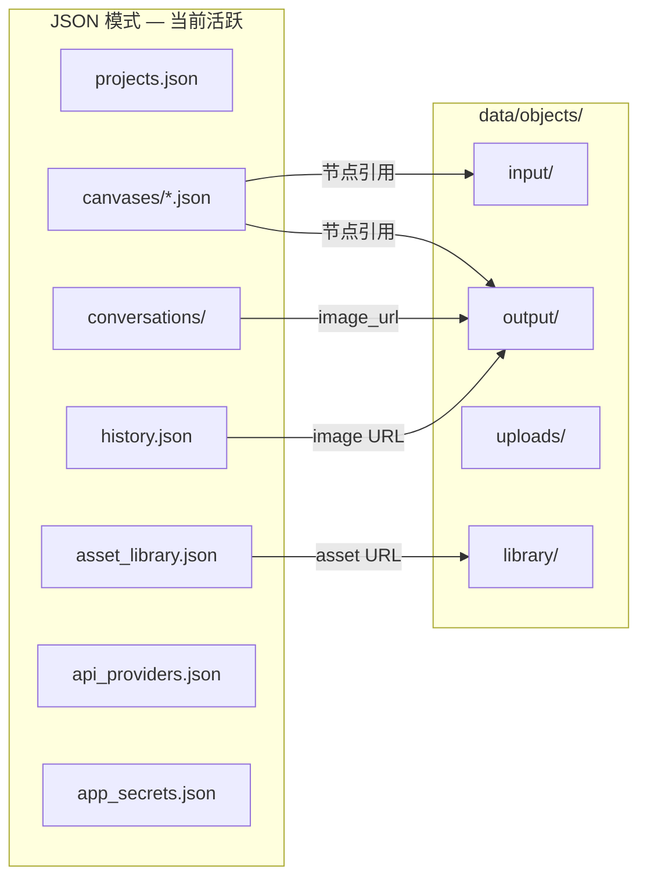

# data/ 目录布局（清理后）

> 更新：2026-07-12 · 清理后快照  
> 相关设计文档：[LOCAL_STORAGE_ARCHITECTURE.md](./LOCAL_STORAGE_ARCHITECTURE.md)

## 当前运行模式

| 项 | 值 |
|---|---|
| **活跃后端** | `json`（存在 `projects.json` 等遗留 JSON 时自动选用） |
| **数据根目录** | `data/`（环境变量 `INFINITE_CANVAS_DATA_DIR` 可覆盖） |
| **对象根目录** | `data/objects/`（环境变量 `INFINITE_CANVAS_OBJECTS_DIR` 可覆盖） |
| **SQLite** | 已移除测试残留库；切换到 sqlite 模式时会通过迁移 API 重新生成 `infinite-canvas.db` |

## 目录结构（清理后）

```text
data/
├── api_providers.json      # 服务商配置（模型列表、协议，不含密钥）
├── app_secrets.json          # API Key 等敏感值（独立存储）
├── asset_library.json        # 素材库元数据
├── projects.json             # 项目列表
├── prompt_libraries.json     # 提示词库
├── history.json              # 生成历史（online 记录）
│
├── conversations/            # 聊天会话（按用户 ID 分目录）
│   └── <user-uuid>/
│       └── <conversation-id>.json
│
├── canvases/                 # 画布 JSON（当前为空，运行时会自动创建）
├── media_previews/           # 媒体预览缓存（当前为空）
│
├── objects/                  # 对象存储（LocalObjectStore）
│   ├── input/                # 参考图 / AI 上传输入（当前为空）
│   ├── output/               # 生成产物（图片/视频）
│   ├── uploads/              # 用户上传（当前为空）
│   ├── library/              # 素材库文件（当前为空）
│   └── previews/             # 预览缩略图（当前为空）
│
└── _pre_cleanup_archive_20260712/   # 本次清理备份（可整目录删除）
    └── manifest.json                # 删除清单与保留说明
```

## 活跃数据一览

### 结构化 JSON

| 文件 | 内容 |
|---|---|
| `projects.json` | 1 个项目（`default`） |
| `api_providers.json` | ModelScope、RunningHub 等服务商配置 |
| `app_secrets.json` | 已配置的 API 密钥（**勿提交 git**） |
| `asset_library.json` | 默认资产库骨架（分类为空） |
| `prompt_libraries.json` | 提示词库数据 |
| `history.json` | 2 条 online 生成记录 |

### 会话

| 路径 | 说明 |
|---|---|
| `conversations/ffddca63-dd44-4090-a0d6-40d98a4b72d9/` | 真实用户会话 × 3（含 Agent 画图记录） |

### 对象文件（8 张图片，约 8.7 MB）

| 键 | 来源 | 引用方 |
|---|---|---|
| `output/online_*.png` × 6 | ModelScope online 生成 | `history.json` |
| `output/chat_*.png` × 2 | Agent 聊天画图 | `conversations/ffddca63-…/` |

## 数据流关系



## 2026-07-12 清理摘要

完整清单见 `data/_pre_cleanup_archive_20260712/manifest.json`。

### 已删除（25 项）

| 类别 | 数量 | 说明 |
|---|---|---|
| 测试会话目录 | 5 | `diag-user-1`、`flow-test-user`、`model-test`、`test-debug`、`test-debug2` |
| 空会话目录 | 2 | `0d8ef886-…`、`default` |
| 测试/孤立对象 | 14 | `input/` 桩文件、`uploads/` 集成测试桩、`archive_ref.png`、`workflow-test_*.png` |
| 已删画布 | 1 | 空节点且 `deleted_at` 已标记的画布 |
| 备份文件 | 1 | `history.json.bak_mock_cleanup_*` |
| SQLite 测试库 | 1 | `infinite-canvas.db`（含 22 画布/11 会话的测试残留，与活跃 JSON 不一致） |
| history 修正 | 1 | 移除 `type: workflow-test` 条目 |

### 明确保留

- 全部 provider / secrets / 提示词库配置
- 2 条真实 online 生成历史 + 6 张对应图片
- 3 个真实聊天会话 + 2 张 Agent 生成图
- `API/.env`（项目外，未触碰）

### 未删除但可选手动清理

- `data/_pre_cleanup_archive_20260712/` — 确认无需回滚后可 `rm -rf` 整个目录

## JSON 与 SQLite 双模式说明

应用按以下优先级选择后端（见 `backend/config.py`）：

1. 环境变量 `INFINITE_CANVAS_STORAGE_BACKEND=json|sqlite`
2. 标记文件 `data/.sqlite_migration_complete`
3. 遗留 JSON 文件存在 → **json**
4. 否则 → sqlite

当前因 `projects.json` 等文件存在，运行在 **json 模式**。  
执行 `POST /api/system/migrate-to-sqlite` 成功后会：

- 生成 `infinite-canvas.db`
- 写入 `.sqlite_migration_complete` 与 `storage_backend`
- JSON 源文件保留作导入备份（可手动归档，不建议在未备份前删除）

## 相关环境变量

| 变量 | 默认 | 作用 |
|---|---|---|
| `INFINITE_CANVAS_DATA_DIR` | `<项目>/data` | 结构化数据根 |
| `INFINITE_CANVAS_OBJECTS_DIR` | `<data>/objects` | 对象存储根 |
| `INFINITE_CANVAS_DATABASE_PATH` | `<data>/infinite-canvas.db` | SQLite 路径 |
| `INFINITE_CANVAS_STORAGE_BACKEND` | 自动推断 | 强制 json/sqlite |

## 变更记录

### 2026-07-12 — 初始版本（post-cleanup）

- 清理测试会话、测试对象、孤立 SQLite 测试库、workflow-test 历史条目
- 备份至 `data/_pre_cleanup_archive_20260712/`
- 保留真实生成图片与聊天会话
